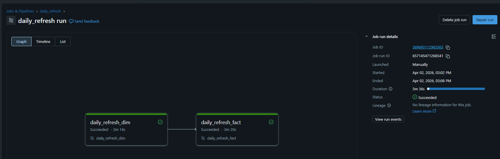
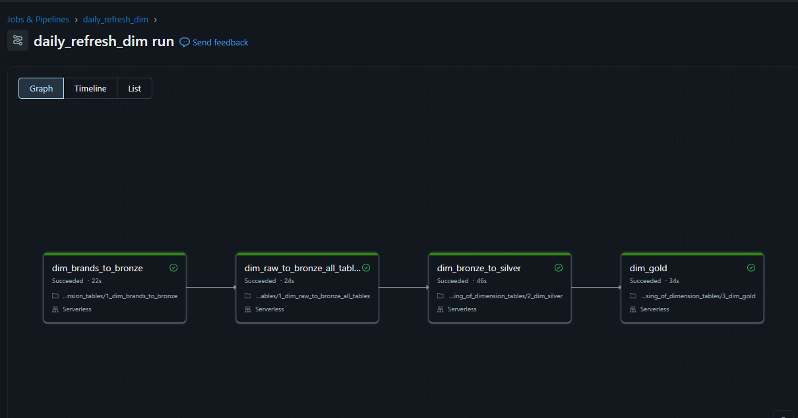
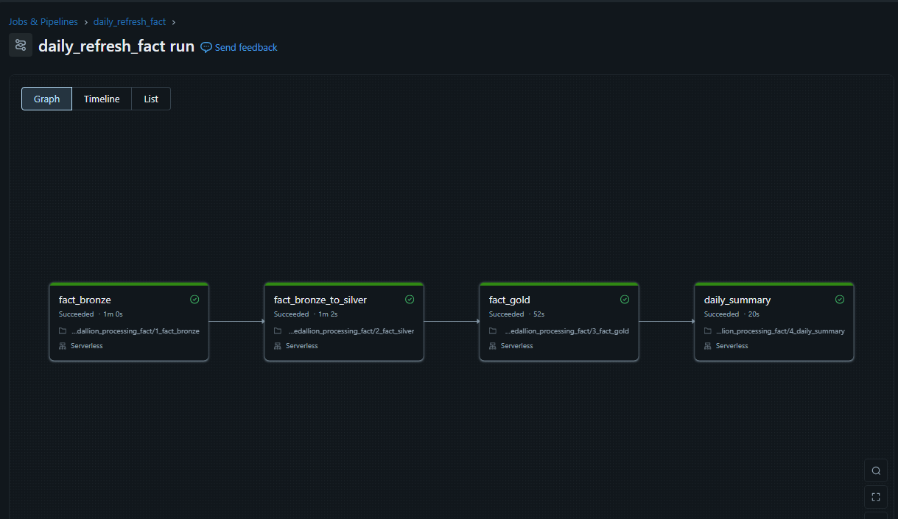
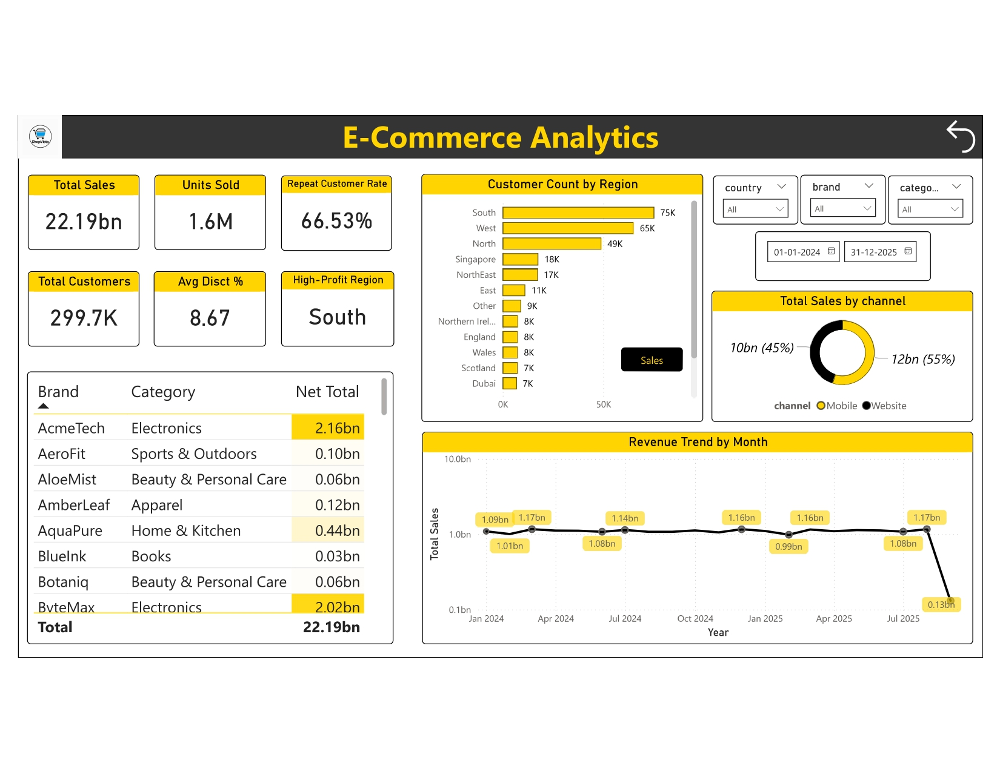

# 🚀 ShopVista Data Engineering Pipeline (Azure Databricks + Delta Lake)

A **production-grade end-to-end data engineering project** that implements the **Medallion Architecture (Bronze → Silver → Gold)** on **Azure Databricks**, powered by **Delta Lake** and **ADLS Gen2**, and visualized using **Power BI**.

This project simulates a real-world **e-commerce data modernization initiative** for a global retail company operating across multiple countries, transforming fragmented raw data into a **scalable, governed, analytics-ready data platform**.

---

## 📌 Project Summary

**ShopVista** is a fictional global e-commerce company operating in:

🌍 India | USA | UK | Australia | UAE | Singapore | Canada

The organization faced challenges due to:
- fragmented CSV-based data sources,
- manual reconciliation processes,
- delayed reporting cycles,
- lack of centralized analytics.

### 🎯 Solution
This project builds a **modern data platform** that:
- automates ingestion from ADLS,
- standardizes and cleans data,
- models it into a **star schema**,  
- and delivers **real-time insights via Power BI dashboards**.

---

## 🏗️ Architecture Overview
        ┌────────────────────────────┐
        │   Source Systems (CSV)     │
        │  Orders | Customers | etc  │
        └────────────┬───────────────┘
                     ↓
    ┌──────────────────────────────────┐
    │   ADLS Gen2 (Raw Landing Zone)   │
    └────────────────┬─────────────────┘
                     ↓
    🥉 Bronze Layer (Raw Delta Tables)
                     ↓
    🥈 Silver Layer (Cleaned & Validated)
                     ↓
    🥇 Gold Layer (Star Schema + KPIs)
                     ↓
          📊 Power BI Dashboard


- Built using **Unity Catalog** for governance  
- Uses **external volumes** to connect ADLS with Databricks  
- Fully aligned with **modern lakehouse architecture principles**

---

## 🧰 Tech Stack

| Category            | Tools |
|--------------------|------|
| Cloud              | Azure (ADLS Gen2, Databricks) |
| Processing         | PySpark |
| Storage Format     | Delta Lake |
| Data Modeling      | Star Schema |
| Ingestion          | Auto Loader (cloudFiles) |
| Orchestration      | Notebook-driven (extendable) |
| Governance         | Unity Catalog |
| Visualization      | Power BI |

---

## ⚙️ Data Pipeline Design

## 🥉 Bronze Layer — Raw Ingestion
- Loads raw CSV files into Delta tables  
- Adds metadata columns:
  - `_source_file`
  - `ingest_timestamp`
- Uses **Auto Loader** for streaming ingestion of fact data  

**Tables:**
- `brz_brands`, `brz_category`, `brz_products`
- `brz_customers`, `brz_calendar`
- `brz_order_items` (streaming)
### Streaming Ingestion with Auto Loader (Bronze Layer)
```
spark.readStream
 .format("cloudFiles")
 .option("cloudFiles.format", "csv")
 .option("cloudFiles.schemaLocation", bronze_checkpoint_path)
 .option("cloudFiles.schemaEvolutionMode", "rescue")
 .option("header", "true")
 .option("cloudFiles.inferColumnTypes", "true")
 .option("rescuedDataColumn", "_rescued_data")
 .option("cloudFiles.includeExistingFiles", "true")
 .option("pathGlobFilter", "*.csv")
 .load(adls_path)
 .withColumn("ingest_timestamp", F.current_timestamp())
 .withColumn("source_file", F.col("_metadata.file_path"))
 .writeStream
 .outputMode("append")
 .option("checkpointLocation", bronze_checkpoint_path)
 .trigger(availableNow=True)
 .toTable(f"{catalog_name}.bronze.brz_order_items")
 .awaitTermination()
 ```
### Why Checkpointing?

- Prevents duplicate data ingestion
- Ensures fault tolerance and recovery
- Tracks already processed files (similar to Snowflake Snowpipe)

| Feature                         | Description                                      |
| ------------------------------- | ------------------------------------------------ |
| **cloudFiles (Auto Loader)**    | Incrementally processes only new files           |
| **Schema Evolution (`rescue`)** | Handles schema changes without breaking pipeline |
| **_rescued_data column**        | Captures unexpected or malformed data            |
| **inferColumnTypes**            | Automatically detects column data types          |
| **includeExistingFiles**        | Processes both historical and new files          |
| **append mode**                 | Insert-only (no updates/deletes)                 |
| **availableNow trigger**        | Runs streaming as a batch job                    |
| **checkpointLocation**          | Enables exactly-once processing                  |

### ✅ Validation check
```
display(
    spark.sql(
        f"SELECT count(*) FROM CLOUD_FILES_STATE('{bronze_checkpoint_path}')"
    )
)
```
- Tracks number of processed files
- Confirms checkpoint-based incremental ingestion
- Ensures only new files are processed
---------------------------------------------------------------------------------

## 🥈 Silver Layer — Data Cleansing & Standardization
- Applies business rules and data quality checks:

### 📊 Dimension Table Transformations

### 1️⃣ Brands
- Removed special characters from `brand_code`
- Trimmed whitespace from `brand_name`
- Standardized `category_code` values:
  - BOOKS → BKS  
  - GROCERY → GRCY  
  - TOYS → TOY  

---

### 2️⃣ Category
- Removed duplicate records based on `category_code`
- Converted `category_code` to uppercase for consistency  

---

### 3️⃣ Products
- Standardized `brand_code` and `category_code` to uppercase  
- Converted `weight_grams` from string format (e.g., "250g") to integer  
- Fixed decimal formatting issues in `length_cm`  
- Corrected material spelling errors:
  - Coton → Cotton  
  - Alumium → Aluminum  
  - Ruber → Rubber  

---

### 4️⃣ Customers
- Removed records with null `customer_id` (primary key enforcement)  
- Replaced missing `phone` values with `"Not Available"`  

---

### 5️⃣ Calendar / Date
- Removed duplicate date records  
- Standardized `day_name` formatting (proper case)  
- Converted negative week values to positive  
- Generated formatted fields:
  - `quarter` → Qx-YYYY (e.g., Q1-2024)  
  - `week` → WeekX-YYYY (e.g., Week12-2024)  

---

## 📦 Fact Table — Order Items Transformations

- Removed duplicate records using `(order_id, item_seq)` as composite key  
- Converted textual quantities (e.g., "Two") into numeric values  
- Cleaned `unit_price` by removing currency symbols and casting to numeric  
- Cleaned `discount_pct` by removing `%` and converting to numeric  
- Standardized `coupon_code` to lowercase and trimmed values  
- Normalized `channel` values:
  - web → Website  
  - app → Mobile  
- Added `processed_time` column for processing metadata  

---

## 🔁 Upsert Logic (Conceptual)

- Implemented **MERGE-based upsert** strategy:
  - If record exists → update  
  - If record is new → insert  
- Ensures **idempotent processing** (safe re-runs without duplication)  
- Uses composite keys (`order_id`, `item_seq`) for matching  
```
def upsert_to_silver(microBatchDF, batchId):
    table_name = f"{catalog_name}.silver.slv_order_items"

    if not spark.catalog.tableExists(table_name):
        microBatchDF.write.format("delta") \
            .mode("overwrite") \
            .option("mergeSchema", "true") \
            .saveAsTable(table_name)

        spark.sql(
            f"ALTER TABLE {table_name} SET TBLPROPERTIES (delta.enableChangeDataFeed = true)"
        )
    else:
        deltaTable = DeltaTable.forName(spark, table_name)

        deltaTable.alias("silver_table") \
            .merge(
                microBatchDF.alias("batch_table"),
                "silver_table.order_id = batch_table.order_id AND silver_table.item_seq = batch_table.item_seq"
            ) \
            .whenMatchedUpdateAll() \
            .whenNotMatchedInsertAll() \
            .execute()

df_silver.writeStream.foreachBatch(upsert_to_silver) \
    .format('delta') \
    .option("checkpointLocation", silver_checkpoint_path) \
    .option("mergeSchema", "true") \
    .outputMode("update") \
    .trigger(availableNow=True) \
    .start() \
    .awaitTermination()
```
- Implements idempotent upsert logic
- Uses `foreachBatch` for micro-batch processing
- Supports schema evolution
- 
### ⚠️ Common Issue: Checkpoint Partition Mismatch
1. 🧠 Issue Summary
   - Streaming job failed due to mismatch in partition count:
   - Previous run (checkpoint): 200 partitions
   - Current run: 1 partition
2. ⚙️ Root Cause
   - Structured Streaming checkpoints store `offsets` , `schema metadata` and `partitioning information`
   - When partition count changes, Spark cannot reconcile old and new states → failure.
   - 🔥 Resolution: Deleting the checkpoint -> this removes old metadata, allows fresh execution and aligns with new partitioning.
3. 🚀 Best Practices
   - Never reuse checkpoints when partitioning changes or code logic changes
   - Always use a new checkpoint path or maintain consistent partitioning
----------

## 🥇 Gold Layer — Business-Ready Data Model

This section highlights the **key transformations and business logic** applied in the Gold layer to create **analytics-ready dimension tables**.

### 📦 Product Dimension (`gld_dim_products`)

- Joined product data with **brand and category reference tables**
- Enriched product records with:
  - `brand_name`
  - `category_name`
- Used **LEFT JOIN** to retain all product records even if mappings are missing  
- Applied **default fallback values** (`"Not Available"`) for missing brand/category names  
- Created a **fully enriched product dimension** for downstream analytics  

---

### 👤 Customer Dimension (`gld_dim_customers`)

- Built a **custom region mapping framework** across multiple countries  
- Mapped **state → region** using predefined dictionaries for:
  - India, USA, UK, Australia, UAE, Singapore, Canada  
- Created a **master mapping table** combining all country-region logic  
- Joined customer data with region mapping to derive `region_name`  
- Assigned `"Other"` for unmapped or missing regions  
- Enabled **geographical analysis and regional segmentation**  

---

### 📅 Date Dimension (`gld_dim_date`)

- Derived **month name** from date for readability  
- Created `date_id` in `yyyyMMdd` format for efficient joins  
- Added **weekend flag (`is_weekend`)**:
  - 1 → Weekend  
  - 0 → Weekday  
- Reordered columns for **optimized reporting and usability**  

---
### 🔄 Aggregation & KPI Table Summary

### 🔄 Change Data Processing

- Consumes **incremental data** from the Silver layer using **Change Data Feed (CDF)**  
- Filters only relevant records:
  - `insert`
  - `update_postimage`  
- Ensures only **latest active records** are processed for BI  
```
#read the silver stream table into a gold dataframe
# we are reading changes data using option(readChangFeed = True)
df_gold = spark.readStream \
.format("delta") \
.option("readChangeFeed","true")\
.table(f"{catalog_name}.silver.slv_order_items")
```
```
#taking up the active data for BI
df_gold_active = df_gold.filter((F.col("_change_type") == "insert") | (F.col("_change_type") == "update_postimage"))
```
### 📊 KPI Derivations: Key business metrics are calculated to support analytical use cases

- **Gross Amount**
  - `quantity × unit_price`

- **Discount Amount**
  - Calculated using discount percentage  
  - Rounded up using ceiling function  

- **Net Amount (Sale Amount)**
  - `gross_amount − discount_amount + tax_amount`

- **Coupon Flag**
  - `1` → coupon applied  
  - `0` → no coupon  

- **Date ID**
  - Derived in `yyyyMMdd` format for efficient joins with date dimension  

---

### 🧾 Data Standardization & Modeling

- Renamed columns to **business-friendly names**:
  - `order_id → transaction_id`
  - `item_seq → seq_no`
  - `dt → transaction_date`
  - `order_ts → transaction_ts`

- Selected only **relevant analytical fields**
- Ensured consistent schema aligned with **fact table design**

---
### 🔁 Upsert Strategy (Gold Fact Table)

- Implemented **MERGE-based upsert logic**:
  - Match on `(transaction_id, seq_no)`
  - Update existing records
  - Insert new records  

- Ensures:
  - **Idempotent processing**
  - No duplicate records  
  - Safe reprocessing

 ```
def upsert_to_gold(microBatchDF, batchId):
    table_name = f"{catalog_name}.gold.gld_fact_order_items"
    if not spark.catalog.tableExists(table_name):
        print("creating new table")
        microBatchDF.write.format("delta").mode("overwrite").saveAsTable(table_name)
        spark.sql(
            f"ALTER TABLE {table_name} SET TBLPROPERTIES (delta.enableChangeDataFeed = true)"
        )
    else:
        deltaTable = DeltaTable.forName(spark, table_name)
        deltaTable.alias("gold_table").merge(
            microBatchDF.alias("batch_table"),
            "gold_table.transaction_id = batch_table.transaction_id AND gold_table.seq_no = batch_table.seq_no",
        ).whenMatchedUpdateAll().whenNotMatchedInsertAll().execute()
``` 

---
### ⚡ Streaming Execution

- Uses **micro-batch processing (`foreachBatch`)**  
- Triggered using:
  - `availableNow` → processes all available data  
  - `once` → executes as batch job  

- Maintains state using **checkpointing**  
- Supports **schema evolution**
```
orders_gold_df.writeStream.trigger(availableNow=True).foreachBatch(
    upsert_to_gold
).format("delta").option("checkpointLocation", gold_checkpoint_path).option(
    "mergeSchema", "true"
).outputMode(
    "update"
).trigger(
    once=True
).start().awaitTermination()
```
----
## 📊 Gold Layer — Daily Summary Table (`gld_fact_daily_orders_summary`)

This section describes the creation of a **daily aggregated KPI table** used for high-level reporting and dashboard performance optimization.

---

## 🔄 Incremental Processing Logic

- Retrieves the **latest transaction date** from the Gold fact table  
- Applies a **rolling window filter (last 30 days)** for incremental updates  
- If the table does not exist:
  - Processes **full historical data**
- If the table exists:
  - Processes only **recent data (incremental refresh)**  
```
max_date = spark.sql(f"SELECT max(transaction_date) FROM {catalog_name}.gold.gld_fact_order_items").collect()[0][0]

if spark.catalog.tableExists(f'{catalog_name}.gold.{table_name}'):
    where_clause = f"transaction_date >= date_sub(date('{max_date}'),{date_cutoff})"
else:
    where_clause = "1=1"
```
---

### 📈 Aggregations Performed

Data is aggregated at:

- **Date level (`date_id`)**
- **Currency level**

### Key Metrics Computed:

- **Total Quantity**
- **Total Gross Amount**
- **Total Discount Amount**
- **Total Tax Amount**
- **Total Net Amount (Final Revenue)**
```
summary_df_query = f"""
SELECT 
    date_id,
    unit_price_currency AS currency,
    SUM(quantity) AS total_quantity,
    SUM(gross_amount) AS total_gross_amount,
    SUM(discount_amount) AS total_discount_amount,
    SUM(tax_amount) AS total_tax_amount,
    SUM(net_amount) AS total_amount
FROM {catalog_name}.gold.gld_fact_order_items
WHERE {where_clause}
GROUP BY date_id, currency
ORDER BY date_id DESC
"""
```
---

### 🧾 Data Modeling

- Groups transactional data into **daily summaries**
- Maintains **currency-level granularity**
- Orders data by **most recent dates first**
- Designed for **fast BI queries and dashboard consumption**

---

### 🔁 Upsert Strategy

- Uses **MERGE-based upsert logic**:
  - Match on `(date_id, currency)`
  - Update existing records
  - Insert new records  

- Ensures:
  - No duplicate aggregations  
  - Consistent incremental updates  
  - Idempotent processing  

```
summary_df = spark.sql(summary_df_query)

if not spark.catalog.tableExists(f'{catalog_name}.gold.{table_name}'):
    summary_df.write.format('delta').mode("overwrite").saveAsTable(f'{catalog_name}.gold.{table_name}')
    #boosting performance
    spark.sql(f"ALTER TABLE {catalog_name}.gold.{table_name} CLUSTER BY AUTO;")
else:
    deltaTable = DeltaTable.forName(spark,f'{catalog_name}.gold.{table_name}')
    deltaTable.alias("existing_summary_table").\
        merge(
            summary_df.alias("summary_cdf"),\
            "existing_summary_table.date_id = summary_cdf.date_id AND existing_summary_table.currency = summary_cdf.currency"
        ).whenMatchedUpdateAll().whenNotMatchedInsertAll().execute()
```
---
### ⚡ Performance Optimization

- Applies **auto clustering** on the table
  ```
  #boosting performance
    spark.sql(f"ALTER TABLE {catalog_name}.gold.{table_name} CLUSTER BY AUTO;")
  ```
- Improves:
  - Query performance  
  - Scan efficiency  
  - Dashboard responsiveness  

---

## 🔄 End-to-End Pipeline Workflow
1. Parent_job: (daily_refresh)


2. daily_refresh = daily_refresh_dim + daily_refresh_fact



## ⚙️ Connecting to the Power BI Dashboard
- Connect the Power BI desktop to Azure databricks by filling the details in the connector.
- Databricks details can be found via `SQL Warehouses`.
- Create a user using `Unity Catalog` and grant permission only on the Gold layer (BI ready).
- Connect via the same user in Power BI to access the tables created with relevant permissions.

### 📊 Power BI Dashboard Overview

The Power BI dashboard is built on top of the **Gold layer**, enabling direct access to clean, business-ready data for reporting and analysis.
---



## 📌 Key Metrics

| KPI                     | Value            |
|-------------------------|------------------|
| Total Sales             | $22.19 Billion   |
| Units Sold              | 1.6 Million      |
| Total Customers         | 299.7K           |
| Repeat Customer Rate    | 66.53%           |
| Average Discount %      | 8.67%            |
| Top Performing Region   | South            |

---

### 📈 Visualizations

- 📊 **Customer Distribution by Region**  
  Displays the number of customers across regions using a horizontal bar chart  

- 🍩 **Sales Contribution by Channel**  
  Compares revenue split between:
  - Mobile (45%)  
  - Website (55%)  

- 📈 **Monthly Revenue Trend**  
  Shows sales progression from **January 2024 to July 2025**  

- 📋 **Brand vs Category Performance Table**  
  Highlights net sales across different brand and category combinations  

- 🔽 **Interactive Filters (Slicers)**  
  Allows users to dynamically filter data by:
  - Country  
  - Brand  
  - Category  
  - Date Range  

---

## 🏁 Project Conclusion

This project successfully demonstrates the design and implementation of a **modern, scalable data engineering pipeline** using the Medallion Architecture on Azure Databricks.

By transforming fragmented raw data into **clean, structured, and analytics-ready datasets**, the pipeline establishes a **single source of truth** for business reporting. The integration with Power BI enables stakeholders to derive insights in near real-time, significantly improving decision-making efficiency.

The solution showcases how a well-architected data platform can:
- streamline data ingestion and processing,
- enforce data quality and consistency,
- and deliver high-performance analytical datasets.

Overall, this project reflects a **real-world production use case** of building a robust lakehouse-based data platform.

---

## 📚 Key Learnings

Throughout this project, several important data engineering concepts and practices were applied:

- **Medallion Architecture (Bronze → Silver → Gold)** for layered data processing  
- **Streaming ingestion using Auto Loader** for scalable file-based pipelines  
- **Checkpointing and fault tolerance** in Structured Streaming  
- **Change Data Feed (CDF)** for incremental data processing  
- **MERGE-based upserts** to ensure idempotent data loads  
- **Schema evolution handling** to manage dynamic data sources  
- **Data modeling using Star Schema** for analytical workloads  
- **Performance optimization techniques** like clustering and aggregation tables  
- **End-to-end pipeline orchestration** using Databricks workflows  

---

## ⚠️ Challenges & Solutions

| Challenge | Solution |
|----------|----------|
| Duplicate processing risk in streaming | Implemented checkpointing |
| Schema changes in incoming files | Used schema evolution with rescue mode |
| Handling updates in streaming data | Used Change Data Feed (CDF) |
| Ensuring no duplicate records | Implemented MERGE-based upserts |
| Partition mismatch errors | Reset checkpoint and standardized configuration |

---

## 💡 Final Thoughts

This project highlights the transition from **traditional ETL pipelines to modern data engineering practices** using a lakehouse architecture.

It not only demonstrates technical implementation but also emphasizes:
- scalability,
- reliability,
- and business impact.

Such architectures form the backbone of **data-driven organizations**, enabling faster insights and better strategic decisions.

---
Feel free to ⭐ the repo if you found this useful!


